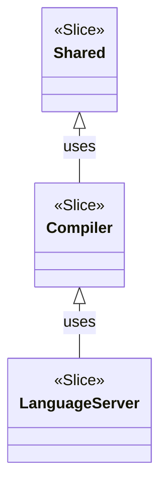

# アーキテクチャ

Clean Architecture をベースにした、Vertical Slice で構成されている。
スライスは関心事ごとに分離され、他のスライスからの依存関係は一方向である。

## スライスの単位

- `Shared` : コアドメイン、他スライスから参照される共通のユーティリティやライブラリ
- `Features/Compiler` : コンパイラのアプリケーションロジック
- `Features/Language Server` : Language Server のアプリケーションロジック

### 関係性

